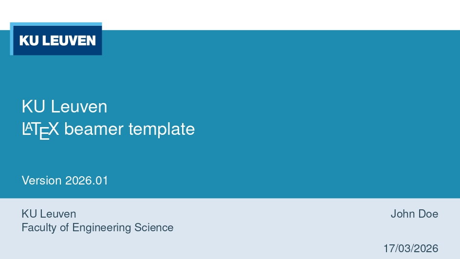
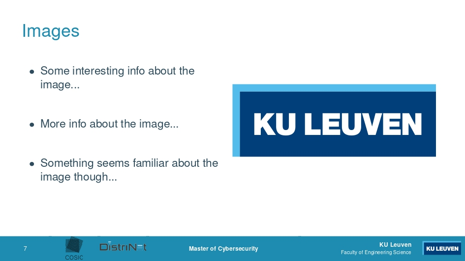

# KU Leuven LaTeX beamer template for Advanced Master in Cyber Security

This is a template to create a KU Leuven presentation with LaTeX.

## Requirements

- A LaTeX distribution (e.g.: texlive) 
  Debian based systems: `apt-get install texlive-latex-base texlive-latex-recommended texlive-latex-extra`
- Python3 pygments (used by minted) 
  Debian based systems: `apt-get install python3-pygments`

## Examples

**Title page**

  
**Standard page with an image**

## License

The LaTeX code for this template is open-source and is licensed as
[GPLv3](LICENSE). However, the KU Leuven logo and layout are (probably)
copyrighted by KU Leuven.

